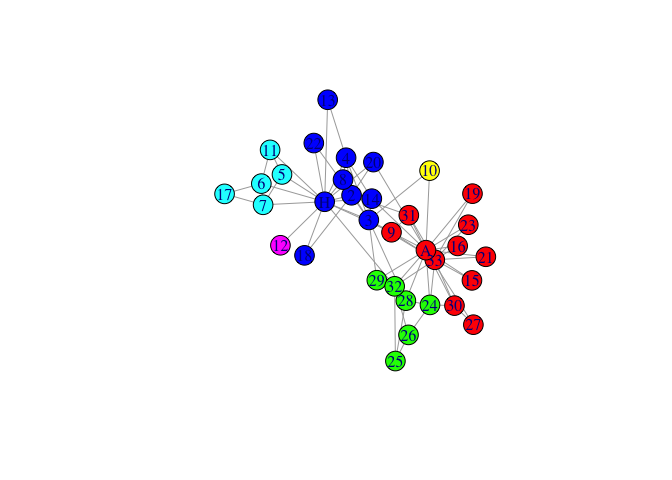
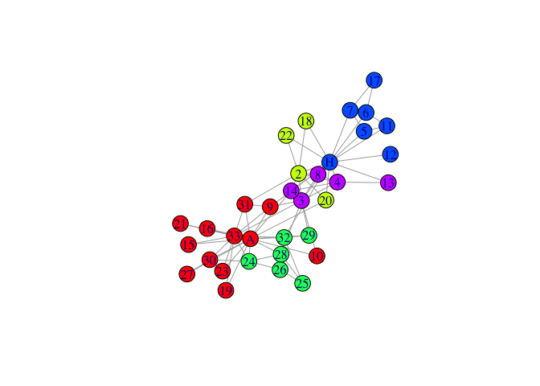
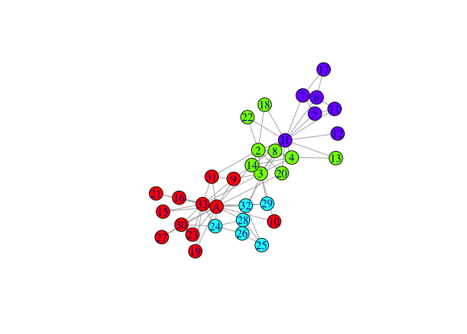

<!-- README.md is generated from README.Rmd. Please edit that file -->

# rSpectral

<!-- badges: start -->
<!-- badges: end -->

The goal of rSpectral is to make Spectral Modularity graph clustering
method available to most of R graph frameworks.

## Installation

You can install the development version of rSpectral from
[GitHub](https://github.com/) with:

``` r
# install.packages("devtools")
devtools::install_github("cmclean5/rSpectral")
```

## Example

This is a basic example which shows you how to solve a common problem

1.  load the karate club graph:

``` r
library(rSpectral)
library(igraph)
#> 
#> Attaching package: 'igraph'
#> The following object is masked from 'package:rSpectral':
#> 
#>     membership
#> The following objects are masked from 'package:stats':
#> 
#>     decompose, spectrum
#> The following object is masked from 'package:base':
#> 
#>     union
data(karate, package="igraphdata")
l<-layout_nicely(karate)
```

2.  store graph’s edges as data.frame

``` r
el = as.data.frame(get.edgelist(karate,names=T))

rSpectral::load_data(df=el)
```

3.  run spectral clustering on graph

``` r
status = rSpectral::spectral(fix_neig=0)
spec0   = rSpectral::membership(detach_graph=0)

idx<-match(V(karate)$name,spec0$ID)
mem0<-spec0$K[idx]
```

4.  plot the graph with membership colors

``` r
palette <- rainbow(max(as.numeric(mem0)))
plot(karate,vertex.color=palette[mem0],layout=l)
```



5.  run spectral clustering on graph, fixing neighbouring nodes found in
    same community

``` r
status = rSpectral::spectral(fix_neig=1)
spec1   = rSpectral::membership(detach_graph=0)
idx<-match(V(karate)$name,spec1$ID)
mem1<-spec1$K[idx]
```

6.  and plot again

``` r
palette <- rainbow(max(as.numeric(mem1)))
plot(karate,vertex.color=palette[mem1],layout=l)
```



7.  run spectral clustering - fixing neighbouring nodes, Cnmin=5

``` r
status = rSpectral::spectral(fix_neig=1,Cn_min=5)
spec1.5   = rSpectral::membership(detach_graph=1)
idx<-match(V(karate)$name,spec1.5$ID)
mem1.5<-spec1.5$K[idx]
```

Note, in the last call to we use to clear graph from the memory.

8.  and the last plot

``` r
palette <- rainbow(max(as.numeric(mem1.5)))
plot(karate,vertex.color=palette[mem1.5],layout=l)
```



In that case, don’t forget to commit and push the resulting figure
files, so they display on GitHub and CRAN.
