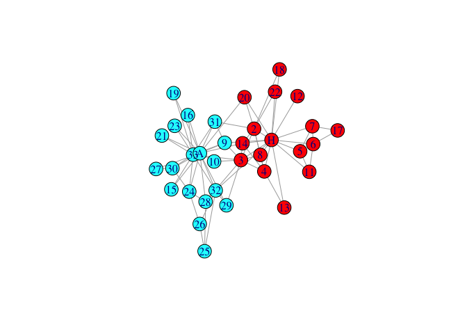
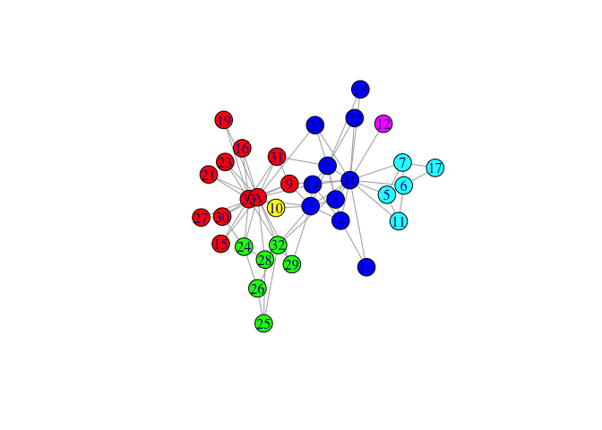
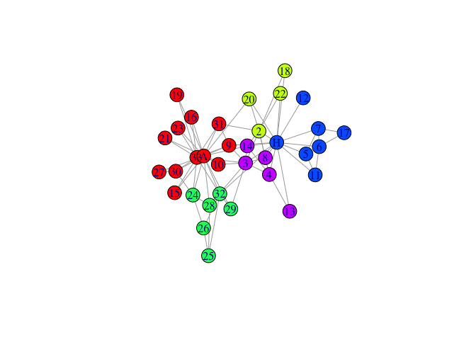
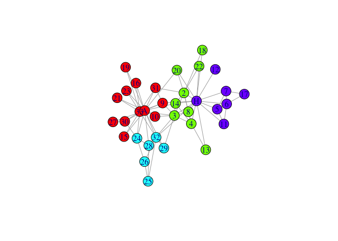

<!-- README.md is generated from README.Rmd. Please edit that file -->

# rSpectral

<!-- badges: start -->
<!-- badges: end -->

The goal of ‘rSpectral’ is to make Spectral Modularity graph clustering
method available to most of R graph frameworks.

## Installation

You can install the development version of rSpectral from
[GitHub](https://github.com/) with:

``` r
# install.packages("devtools")
devtools::install_github("cmclean5/rSpectral")
```

## Example

This is a basic example which shows you how to solve a common problem

1.  load the karate club graph and plot Faction membership:

``` r
library(rSpectral)
library(igraph)
#> 
#> Attaching package: 'igraph'
#> The following objects are masked from 'package:stats':
#> 
#>     decompose, spectrum
#> The following object is masked from 'package:base':
#> 
#>     union
data(karate, package="igraphdata")
l<-layout_nicely(karate)
memT<-V(karate)$Faction
palette <- rainbow(max(as.numeric(memT)))
plot(karate,vertex.color=palette[memT],layout=l)
```



2.  run spectral clustering on graph

``` r
mem0<-igraph::membership(rSpectral::spectral_igraph_communities(karate))
```

3.  plot the graph with membership colors

``` r
palette <- rainbow(max(as.numeric(mem0)))
plot(karate,vertex.color=palette[mem0],layout=l)
```



4.  run spectral clustering on graph, fixing neighbouring nodes found in
    same community

``` r
mem1<-igraph::membership(
  rSpectral::spectral_igraph_communities(karate, fix_neig=1))
```

5.  and plot again

``` r
palette <- rainbow(max(as.numeric(mem1)))
plot(karate,vertex.color=palette[mem1],layout=l)
```



6.  run spectral clustering - fixing neighbouring nodes, Cnmin=5

``` r
mem1.5<-igraph::membership(
  rSpectral::spectral_igraph_communities(karate, fix_neig=1,Cn_min=5))
```

5.  and the last plot

``` r
palette <- rainbow(max(as.numeric(mem1.5)))
plot(karate,vertex.color=palette[mem1.5],layout=l)
```



`GraphNEL` objects could be processed similarily, all other graph types
could be converted either to `igraph` or to `GraphNEL` by packages such
as `Intergraph`.
